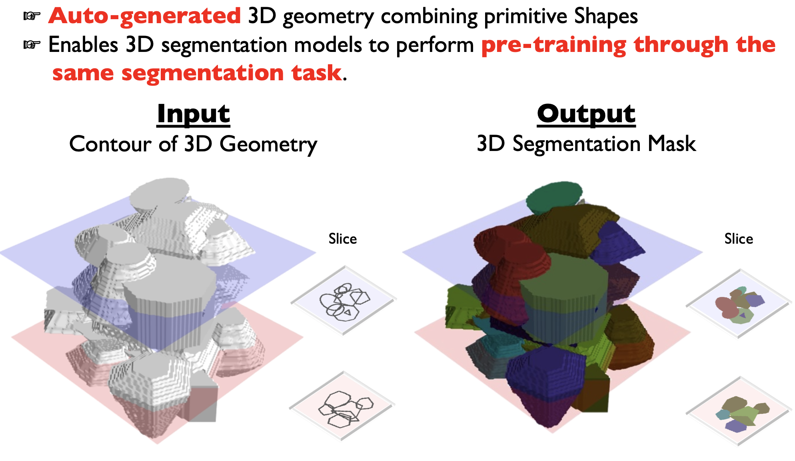
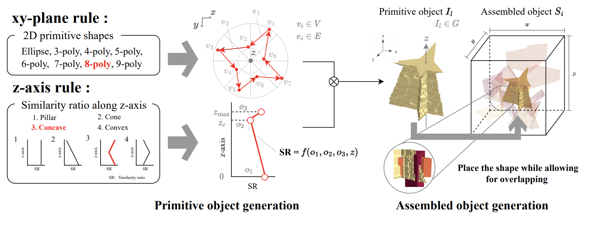

# PrimGeoSeg for 3D Medical Image Segmentation


This repository contains implementation for the generation of PrimGeoSeg dataset (/AVS-DB), pre-training dataset for PrimGeoSeg (/AVS-DB), PrimGeoSeg pre-trained model. 

"Primitive Geometry Segment Pre-training for 3D Medical Image Segmentation", BMVC2023 (Oral) [[Proceedings](https://proceedings.bmvc2023.org/152/)] [[Paper](https://papers.bmvc2023.org/0152.pdf)] [[Supplementary](https://bmvc2022.mpi-inf.mpg.de/BMVC2023/0152_supp.zip)] [[Video](https://bmvc2022.mpi-inf.mpg.de/BMVC2023/0152_video.mp4)]

"Pre-Training Auto-Generated Volumetric Shapes for 3D Medical Image Segmentation", CVPRW2023 (Short Paper) [[Paper](https://openaccess.thecvf.com/content/CVPR2023W/ECV/papers/Tadokoro_Pre-Training_Auto-Generated_Volumetric_Shapes_for_3D_Medical_Image_Segmentation_CVPRW_2023_paper.pdf)]

## Generation for PrimGeoSeg Dataset

To construct the pre-training dataset for PrimGeoSeg, please run the following code. You can customize the dataset by modifying the hyperparameters.
```
cd data_generation
pip install -r requirements.txt
bash run.sh
```

## Pre-trained Weights for PrimGeoSeg
|Architecture |Pre-training Size                          |Weights                         |
|----------------|-------------------------------|-----------------------------|
|UNETR|50,000|[UNETR_50000.pt](https://drive.google.com/file/d/1NP_WmRswaOSywqrHw_yTAaFjPhwgi34Y/view?usp=drive_link)|
|SwinUNETR          |5,000|[SwinUNETR_5000.pt](https://drive.google.com/file/d/1NbQqa2jolWbFUYriugNoW4d_vgFykn6m/view?usp=drive_link)|

To load the above chectpoint, please use this code

```
from  monai.networks.nets  import  SwinUNETR, UNETR

# Hyperparameters
roi_x, roi_y, roi_z  =  96, 96, 96
in_channels  =  1
out_channels  =  2  # Set for your target task
feature_size  =  48

# For SwinUNETR
model  =  SwinUNETR(
  img_size=(roi_x, roi_y, roi_z),
  in_channels=in_channels,
  out_channels=out_channels,
  feature_size=feature_size,
  drop_rate=0.0,
  attn_drop_rate=0.0
)

# For UNETR
model  =  UNETR(
  img_size=(roi_x, roi_y, roi_z),
  in_channels=in_channels,
  out_channels=out_channels,
  feature_size=16,
  hidden_size=768,
  mlp_dim=3072,
  num_heads=12,
  pos_embed='conv',
  norm_name='instance',
  conv_block=True,
  res_block=True,
  dropout_rate=0.0
)
	
# Load weight 
state_dict = torch.load('Path to checkpoint path')
model.load_state_dict(state_dict, strict=False)
```


## Pre-training Dataset for PrimGeoSeg
preparing...
|Dataset Size |Pre-training Size                          |
|----------------|-------------------------------|
|50,000|[Google Drive]            |
|5,000          |[Google Drive]            |


## Pre-training & Finetuning
This project builds upon the groundbreaking work found in [the MONAI Research Contributions](https://github.com/Project-MONAI/research-contributions/tree/main/SwinUNETR), specifically focusing on the SwinUNETR/BTCV implementation. Our approach involves an innovative application of this existing framework for the segmentation task using the PrimGeoSeg dataset.

### Pre-Training with PrimGeoSeg
The core of our experiment lies in adapting the pre-training process to the PrimGeoSeg dataset. Originally designed for 3D medical image segmentation, this methodology can be seamlessly transitioned to work with the PrimGeoSeg dataset. To do so, simply replace the input dataset in the code with PrimGeoSeg, while keeping the segmentation task consistent with the downstream task.

###  Customizing the Architecture
In addition to dataset adaptation, our project offers flexibility in terms of architectural modifications. If you're looking to implement your own architecture, this can be easily achieved by replacing the architecture component in the codebase with your design. This feature allows for extensive experimentation and adaptation, tailoring the project to meet various research needs.


## Cite

 ```
@inproceedings{Tadokoro_2023_BMVC,
	author={Ryu Tadokoro and Ryosuke Yamada and Kodai Nakashima and Ryo Nakamura and Hirokatsu Kataoka},
	title={Primitive Geometry Segment Pre-training for 3D Medical Image Segmentation},
	booktitle={34th British Machine Vision Conference 2023, {BMVC} 2023, Aberdeen, UK, November 20-24, 2023},
	publisher={BMVA},
	year={2023},
	url={https://papers.bmvc2023.org/0152.pdf}
}
@inproceedings{tadokoro2023avsdb,
  title={Pre-Training Auto-Generated Volumetric Shapes for 3D Medical Image Segmentation},
  author={Ryu Tadokoro, Ryosuke Yamada, Hirokatsu Kataoka},
  booktitle={IEEE Computer Society Conference on Computer Vision and Pattern Recognition Workshops (CVPRW)},
  year={2023}
}
```
